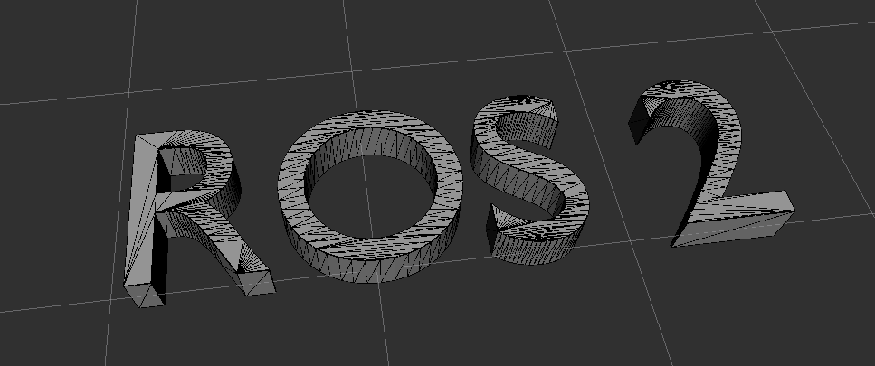
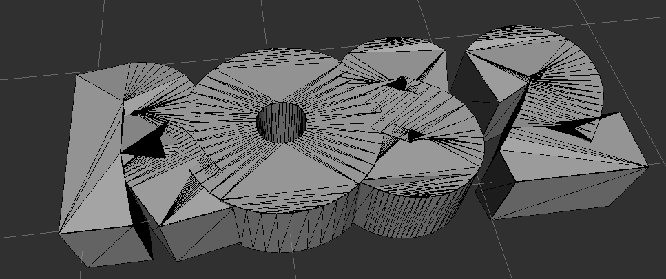

# Visualization of scaling and padding of geometric_shapes

Original mesh | Scaled and padded mesh
:----:|:----:
 | 

To run:

```sh
ros2 launch scale_pad_visualize visualize.launch
```

There are three parameters provided for the launch file:
* ``mesh`` - full path to a mesh file (eg. .stl, .dae) (default: *$(find-pkg-share scale_pad_visualize)/stl/ros2.stl*)
* ``scale`` (default: 1.0)
* ``padding`` (default: 0.0)

Example usage:

```sh
ros2 launch scale_pad_visualize visualize.launch mesh:=$(ros2 pkg prefix --share scale_pad_visualize)/stl/ros2.stl scale:=0.8 padding:=0.2
```

The scale and padding can be modified during runtime, using ``ros2 param set``:

```sh
ros2 param set /visualize scale 1.2
ros2 param set /visualize padding 0.1
```
